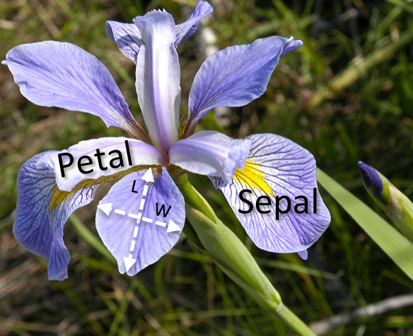

```{r setup, include=FALSE}
knitr::opts_chunk$set(echo = TRUE)
```
## Introduction to the Iris Dataset

Let's explore the use of kNN as a classification algorithm on the famous Iris dataset. This dataset should already be present in the installation of R and can be loaded with the command

```{r}
data(iris)
```

We can get an explanation of the what's in the dataset with the help function

```{r}
help(iris)
```

The data is now stored in the dataframe 'iris' and we can start to visualize the data with some simple commands:

```{r}
str(iris)

head(iris)

summary(iris)
```
We see that each observation consists of one of 3 species of Iris flower, and for each observation 4 features have been measured: the length and width of the sepals and petals.  



It's always very useful to use graphs to visualize our data.  A useful R package for making nice graphs is ggvis, which can be loaded using the commands 

```{r}
if(!require(ggvis)){
    install.packages("ggvis")
    library(ggvis)
}
```

Then we can look at how Sepal.Width and Sepal.Length are related to the species classes:

```{r}
iris %>% ggvis(~Sepal.Length, ~Sepal.Width, fill = ~Species) %>% layer_points()
```

Setosa appears to be sharply separated from versicolor and virginica by these features.  Similarly we can look at the Petal features:

```{r}
iris %>% ggvis(~Petal.Length, ~Petal.Width, fill = ~Species) %>% layer_points()
```

Again setosa stands apart, but in this case there's a bit less overlap between versicolor and virginica.

Our strategy will be to: 

1. Split our data into a training set and a test set.
2. Use kNN, for different values of k, to predict the species of the flowers in the test set based on the nearest neighbors in the training set.
3. Determine the accuracy of our results and compare for the different values of k.

## Preprocessing

Here we want to do two things.  First, we want to split the data into the training set and test set, but we want to do this in such a way to that the species population of the training and test sets are similar. 

Second, we really want to rescale the data. Note that the Length features are roughly twice as large in magnitude as the Width features.   Now kNN computes nearest neighbors using the Euclidean distance between observations:

$$
\text{distance}  =  \sqrt{(L_1-L_2)^2 + (W_1-W_2)^2}.
$$
If we use the features with their scales as is, we'll give the lengths roughly twice the weight as the widths in our calculations.   Since we have no particular reason to think that lengths are more important than widths, we should transform the data so that we give both types of features equal weight in the distance calculation.  The way we'll do this is by (linearly) mapping the features so that they take values in the range [0,1].

There are various routines built into R for accomplishing these tasks, but the ones we will use are those in the 'caret' package,  which is a popular and powerful package providing tools for predictive modeling.

We can load caret via:

```{r}
if(!require(caret)){
    install.packages("caret")
    library(caret)
}
```
Now one of the function provided by caret is called createDataPartition which will help us create a random partition of a dataset, subject to conditions that we can specify. In particular, we wanted to preserve the balance between the number of classes in the data sets.  In order to produce an 50/50 split that preserves the class balance, we can use the commands

```{r}
set.seed(3456)
trainIndex <- createDataPartition(iris$Species, p = .5, 
                                  list = FALSE, 
                                  times = 1)
head(trainIndex)
```

We used the set.seed command so that we can reproduce the same random split whenever we decide to run the command.  What is actually returned is a vector of indices.  To produce the training and test sets, we can use the indices on the iris dataframe like so:

```{r}
irisTrain <- iris[ trainIndex,]
irisTest  <- iris[-trainIndex,]

summary(irisTrain)
summary(irisTest)
```

Next, we wanted to rescale the data, which we can accomplish using the preProcess function.  The syntax might seem a bit wierd at first:

```{r}
preProcValues <- preProcess(irisTrain, method = c("range"))

irisTrain <- predict(preProcValues, irisTrain)
irisTest <- predict(preProcValues, irisTest)

summary(irisTrain)
summary(irisTest)
```

The method option "ranges" specifies that we want to transform the data to the unit interval [0,1].  We apply preProcess to the training data so that R can learn which linear transformation is needed to do this.  We store this transformation as a model called preProcValues.  Then we can use the base R function predict to apply this model to our training and test sets.  The output in either case is the rescaled features, which we save in (new) data frames with the same names as the old ones for convenience.

Note that we learned the transformation on the training set and applied it to both the training set and the test set. This means that we don't use any information from the test data to learn the transformation.  This is statistically important in that any bias in our models should be coming entirely from our training data,  while the test/validation set is completely unseen during the learning process.   As a result, the test features fall a bit outside the [0,1] interval, but we attribute this to the natural variance of the data.

## Apply kNN

A convenient implementation of kNN is found in the 'class' library (for classification)
```{r}
if(!require(class)){
    install.packages("class")
    library(class)
}
```

We will use the knn() function to implement kNN:
```{r}
help(knn)
```

We need to specify as arguments:

1. The training and test data sets, minus the Species label.
2. The class labels from the training set that we want to predict for the test set, here 'Species'
```{r}
class_labels <- iris$Species[trainIndex]
```
3. The number, k, of neighbors to be considered.

If we want to choose k = 5, then we can make NN predictions using the command
```{r}
iris_pred <- knn(irisTrain[,1:4], irisTest[,1:4], class_labels, k=5)

iris_pred
```

We can compute the percentage of correct predictions from the command
```{r}
100 * sum(iris_pred == irisTest$Species)/(length(irisTest$Species))
```

Let's repeat the predictions for k = 1 through k = 50 and store the accuracy.
```{r}
accuracy_vec = (1:50)
for (i in 1:50){
  iris_pred <- knn(irisTrain[,1:4], irisTest[,1:4], class_labels, k=i)
  accuracy_vec[i] = 100 * sum(iris_pred == irisTest$Species)/(length(irisTest$Species))
}
```

We can plot the results
```{r}
plot(accuracy_vec, xlab = "# of NN", ylab = "% prediction accuracy")
```

We note that the accuracy starts to peak around k = sqrt(50) ~ 7, decreases as we add neighbors and is worst when we've included the entire training sample as nearest neighbors.

## Simulated Data on Credit Card Default

This simulated dataset comes from the supplementary materials accompanying the text "An Introduction to Statistical Learning with Applications in R" by James, Witten, Hastie and Tibshirani (highly recommended!), see http://www.statlearning.com/ for free PDF.   We can include the necessary library via
```{r}
if(!require(ISLR)){
    install.packages("ISLR")
    library(ISLR)
}
summary(Default)
```

We can look at a graph
```{r}
Default %>% ggvis(~balance, ~income, fill = ~default, shape = ~student) %>% layer_points() %>%
  add_legend("shape", properties = legend_props(legend = list(y = 150))) %>%
  add_legend("fill", properties = legend_props(legend = list(y = 50)))
```
These features don't necessarily resolve the classification problem very well, but we'll proceed.

Once again, we want to split the dataset and rescale:
```{r}
set.seed(774)
trainIndex <- createDataPartition(Default$default, p = .5, 
                                  list = FALSE, 
                                  times = 1)
head(trainIndex)
```
```{r}
DefaultTrain <- Default[ trainIndex,]
DefaultTest  <- Default[-trainIndex,]

summary(DefaultTrain)
summary(DefaultTest)
```

```{r}
preProcValues <- preProcess(DefaultTrain, method = c("range"))

DefaultTrain <- predict(preProcValues, DefaultTrain)
DefaultTest <- predict(preProcValues, DefaultTest)

summary(DefaultTrain)
summary(DefaultTest)
```

In addition, student is a categorical features with levels "Yes" and "No", but to use kNN we want our features to be numeric.  We can solve this problem by so-called "one-hot" encoding, where we use a numerical 0 for "No" and 1 for "Yes".  Again, caret provides the dummyVars function to do this, which is especially useful in cases where we have many categorical variables and it would be tedious to encode by hand.
```{r}
dummies <- dummyVars(~ ., data = DefaultTrain, fullRank=T)
DefaultTrain <- data.frame(predict(dummies, newdata = DefaultTrain))
DefaultTest <- data.frame(predict(dummies, newdata = DefaultTest))
colnames(DefaultTrain) <- c("default", "student", "balance", "income")
colnames(DefaultTest) <- c("default", "student", "balance", "income")

summary(DefaultTrain)
summary(DefaultTest)
```
Let's compute the accuracy for  k = 1 through k = 100.
```{r}
class_labels = DefaultTrain[,1]

num_ks = 100
accuracy_vec = (1:num_ks)
for (i in 1:num_ks){
  default_pred <- knn(DefaultTrain[,2:4], DefaultTest[,2:4], class_labels, k=i)
  accuracy_vec[i] = 100 * sum(default_pred == DefaultTest$default)/(length(DefaultTest$default))
}
```

We can plot the results
```{r}
plot(accuracy_vec, xlab = "# of NN", ylab = "% prediction accuracy")
```

However, note that 4833/4999 ~ 97% of the individuals did not default.  So for k > 70 we are misclassifying ALL of the defaults. 